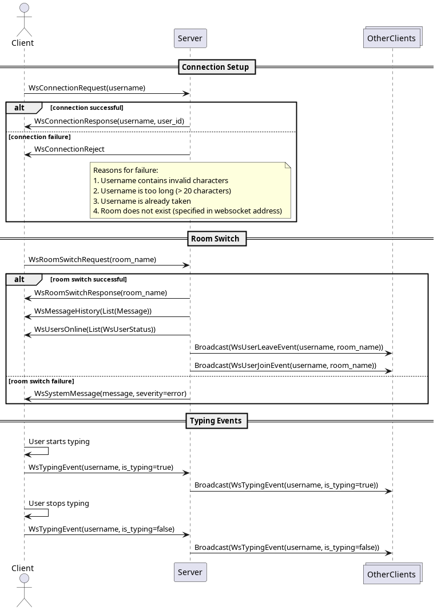

# WebSockets Workshop
WebSockets Workshop hos Tietoevry Umeå 6e November 2025

Mer information kommer när eventet närmar sig.

# Overview
The focus of this workshop is to implement a client for a chat application. The backend server has already been implemented for you, along with the UI.
Your goal is to connect the frontend to the provided chat backend using WebSocket communication. You will handle connection setup, message sending, and event handling within the `frontend/workshop.js` file.

- You will only have to update `frontend/workshop.js`.
- As noted above, the GUI is already provided. While developing, open the `frontend/index.html` in a web browser, and edit the `workshop.js` file. Work in small increments, and refresh the page to see your updates.
- You will be given an IP address to our hosted backend that you will be able to communicate with, set the ip address in `globalThis.backend_server_address`
- There is a multitude of different events that the server will send, for instance when a user joins or leaves, when a message is sent, when a new room is created, etc.

## 🎯 Workshop Structure

You have **only 2 files**:

1. **`workshop.js`** ← **YOU WORK HERE** - Implement WebSocket functionality
2. **`index.html`** ← UI (don't edit this, just open it in browser)

The HTML file is intentionally large and unreadable - it's a *feature*, not a bug! This forces you to focus only on the WebSocket implementation in `workshop.js`.

## Miscellaneous Tips


### JavaScript

New to JavaScript? Use a cheat sheet: [htmlcheatsheet.com/js/](https://htmlcheatsheet.com/js/).

The JavaScript WebSocket API is largely event-driven, have a look at the MDN documentation for the various events that are available:
[Writing WebSocket client applications](https://developer.mozilla.org/en-US/docs/Web/API/WebSockets_API/Writing_WebSocket_client_applications)

### WSL users (Windows Subsystem for Linux)

If you're using WSL and having trouble opening the HTML file, you can try opening a local server on `localhost` with any of the following steps:
```bash
# From your working directory with the index.html file

# with Python 3
python3 -m http.server 8080

# with PHP
php -S localhost:8080

# with Node.js http-server (no install needed)
npx http-server -p 8080

# with Ruby
ruby -run -ehttpd . -p8080

# with darkhttpd (needs: apt install darkhttpd)
darkhttpd . --port 8080
```

### Messages and Events

The messages that you will send and receive are defined in the backend directory, `backend/message_types.py`.
In particular, the messages that are defined in the `WsEvent` union:

```python
WsEvent = Annotated[
    Union[
        WsConnectionRequest,
        WsConnectionResponse,
        WsMessage,
        # and many more ...
    ],
    Field(discriminator="event_type"),
]
```

The server expects to receive these messages as JSON strings, use `JSON.stringify(obj)` to convert an object to a JSON string that you can send via the WebSocket's `send()` function.
```javascript
websocket.send(JSON.stringify({
    event_type: WS_EVENT_TYPES.message,
    username: "MyUserName",
    message: "Hello, world!",
}));
```

### Rooms
The backend server also supports rooms to prevent everyone from spamming the same chat while testing the implementations.
You do not have to do anything special to create a room, just provide a room name and one will be created for you if it does not already exist.
To set the room name you can do **one** of the following:
- Change `globalThis.CONFIG.room_name` to whichever room name that you want.
- Provide a query parameter, in your browser, add `<some_path>/frontend/index.html?room_name=some_room_name` to the end of the url
    - You may also set the username in this manner: `<some_path>/frontend/index.html?room_name=some_room_name&username=some_username`

Using different query parameters in multiple browser tabs allows you to simulate several users and verify that your chat logic behaves correctly.

## Message Sequences
The sequence diagram below details some of the messaging sequences that the client will have to follow.
Note that the messaging is per room, so a broadcast is always associated with a specific room, and will not be sent to clients in the other rooms.

For the typing events, these are used to notfiy other users that a user has started, or stopped, typing text into the input box. It is up to the individual clients themselves to report their typing status via the `WsTypingEvent`.

In the case of the room switching, the `WsUserLeaveEvent` will be broadcast to the user's previous room, and the `WsUserJoinEvent` will be broadcast to the user's new room. A room switch is not complete until the user has received a `WsRoomSwitchResponse`.



## Available Helper Functions
You may use these helper functions:

### UI Functions
```javascript
window.addMessageToUI(message, type, username)
window.addMemberToList(username, status)
window.removeMemberFromList(username)
window.updateOnlineCount()
window.addRoomToList(roomName, isActive)
window.switchToRoom(roomName)
window.clearChat(roomName)
window.addSelfAsOnline()
```

### Toast Functions
```javascript
Toast.success(message)
Toast.error(message)
Toast.warning(message)
Toast.info(message)
```

### Config Access
```javascript
window.chatConfig.username
window.chatConfig.room_name
window.getWsAddress()  // Returns ws:// or wss:// URL
```

## 📚 The 5 Assignments

Complete these in `workshop.js`:

### Assignment 1: WebSocket Connection
- Create WebSocket connection
- Add event listeners (open, close, error, message)
- Send connection request
- Handle acceptance/rejection

**Goal:** Successfully connect to the server

### Assignment 2: Send & Receive Messages
- Implement `wsSendMessage()`
- Handle incoming messages in `wsReceiveMessage()`
- Display messages from other users
- Load message history

**Goal:** Chat with other users

### Assignment 3: User Notifications
- Handle `users_online` event
- Show toast when users join
- Show toast when users leave
- Display system messages

**Goal:** See when users come and go

### Assignment 4: Typing Indicators
- Detect when user types
- Send typing status to server
- Handle timeout after inactivity
- Update UI for other users

**Goal:** See "User is typing..." indicator

### Assignment 5: Room Management
- Implement room switching
- Handle room creation events
- Implement chat clearing
- Update UI for different rooms

**Goal:** Switch between chat rooms

## 💡 Implementation Tips

### Assignment 1 Tips
```javascript
// Remember to stringify JSON
websocket.send(JSON.stringify({ ... }))

// And parse incoming messages
const message = JSON.parse(msg.data)
```

### Assignment 2 Tips
```javascript
// Check if message is from yourself
if (message.username === window.chatConfig.username) {
    // Don't add to UI - you already did that when sending
    return;
}
```

### Assignment 3 Tips
```javascript
// Always check if it's yourself before showing notifications
if (message.username === window.chatConfig.username) {
    return;
}
```

### Assignment 4 Tips
```javascript
// Update lastActivity on every keypress
globalThis.lastActivity = performance.now()

// Check timeout
if ((performance.now() - globalThis.lastActivity) > 2500) {
    // User stopped typing
}
```

### Assignment 5 Tips
```javascript
// Skip Global room in lists
if (room.room_name === "Global") {
    return;
}
```
